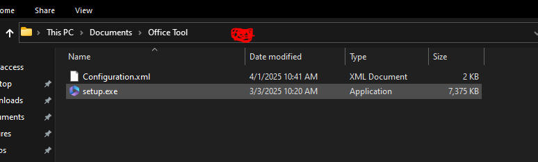

# How to download and install Microsoft Office Tools in Legal Way

*- Before We start make sure you have stable internet connection*  
*- Create new folder so that we can easily navigate the files*  
**Step 1:** Hold "CTRL" key and click the link <a href="https://www.microsoft.com/en-us/download/details.aspx?id=49117">here</a> to open the link in new tab.   
**Step 2:** Download the <b>Deployment Tool and save it to the new folder</b>   
**Step 3:** Hold "CTRL" key and click the link <a href="https://config.office.com/deploymentsettings">here</a> to open the link in new tab.</b>  

*Now follow these steps*

**Inside of the Link you will see the configuration.**
  
## **Products and Releases**
1. **Architecture** - 64-bit (Select 32-bit if you think your OS is 32-bit)
2. **Office Suites** - Select Anything, but I prefer versions that have **Professional Plus** kasi gusto ko bakit ba?
3. **Visio, Project, and Additional Products** - *Optional*
4. **Apps** - Just turn off the ones you don't want to include

**CLICK NEXT**

---

## **Language**
1. Select primary language - *Balakajan*

**CLICK NEXT**

---

## **Installation**

*Don't make changes*

**CLICK NEXT**

---

## **Update and Upgrade**

*Don't make changes*

**CLICK NEXT**

---

## **Licensing and Activation**
1. **Automatically Accept Terms** - Enable

**CLICK NEXT**

---

## **General**

*Don't make changes*

**CLICK NEXT**

---

## **Application Preferences**

**CLICK FINISH**
   
**Step 4:** Click Export (the export button in the bottom, Not TOP!).  
**Step 5:** Select Office XML Formats and Click "OK".  
**Step 5:** Accept the Terms and Rename Configuration File as you want.  
**Step 6:** Click Export and Save it where you create the New Folder  

## **Installation Process**
- Launch the deployment tool and select the folder where you create the new folder.
- Go to that new folder where the Configuration file
- Make sure you have the setup.exe and the XML file (Configuration file).
- Click any blank part like this

